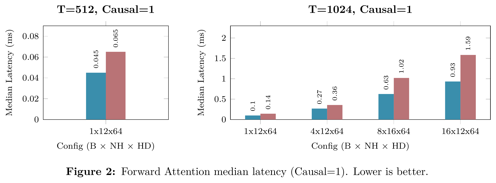
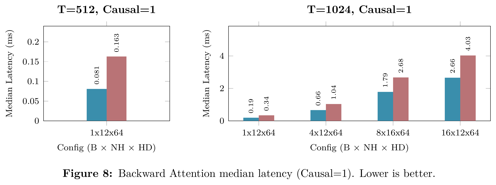
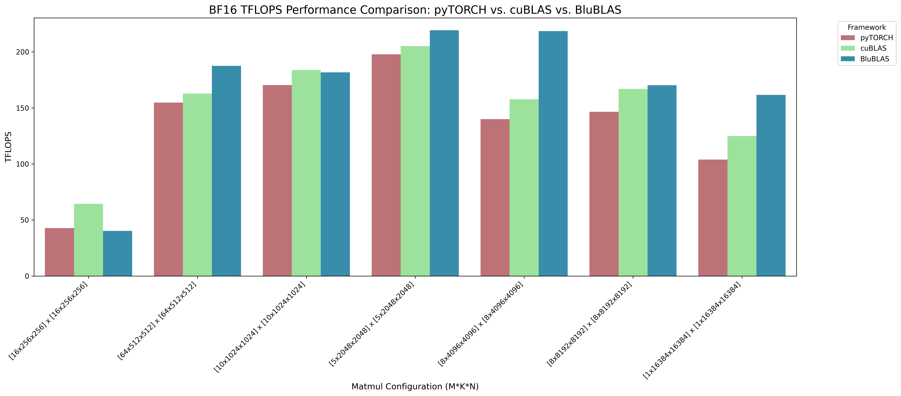
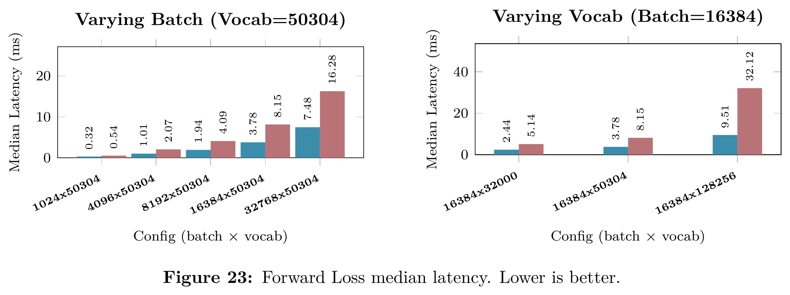

# HyperKernels

**A complete set of hand-written, high-performance CUDA kernels for transformer
training on NVIDIA RTX 6000 Ada Lovelace (`sm_89`).**

HyperKernels covers the whole training step - attention, LayerNorm, GELU,
cross-entropy, the optimizer update, *and* the batched GEMMs underneath them as
standalone CUDA kernels tuned for Ada's 4th-gen tensor cores and built with CUDA 13.0.
Every kernel is a self-contained extraction: its device-side dependency closure is
inlined so a single `nvcc -c` compiles it, with no shared headers and no build system
to stand up. Every kernel is validated against an independent fp32/float reference.

```
attention · layernorm · gelu · cross-entropy · adam        ← compute kernels
        SGEMM (TF32) · BGEMM (BF16) · GEMV · split-K        ← BLAS
                    all sm_89, all tensor-core
```

## Design principles

The advantage comes not from any individual kernel but from one optimization
discipline applied uniformly across the whole operator surface. Five principles
govern every kernel here.

1. **Algorithmic Co-design.** Hardware-agnostic reformulations (online softmax,
   single-pass Welford statistics, saved-statistics cross-entropy) are co-designed with
   hardware-dependent optimizations (TF32/bf16 tensor-core MMA, PTX intrinsics,
   `cp.async` shared-memory pipelining). An elegant algorithm mapped poorly to the
   silicon stalls on microarchitecture; aggressive low-level tuning on a wasteful
   algorithm merely runs redundant work faster. Peak throughput requires both, coupled.

2. **Compile-Time Specialization.** Datatypes, memory layouts, blocking factors, and
   the target architecture are C++ template parameters resolved strictly at compile
   time. Each kernel collapses into a branch-free, fully unrolled binary tailored to
   the exact problem geometry — no runtime dispatch, no dead branches.

3. **Roofline Saturation.** Every kernel is classified by arithmetic intensity and
   engineered to saturate its ceiling. Compute-bound ops (attention, GEMM) maximize
   tensor-core throughput via SRAM reuse and asynchronous DRAM→SRAM `cp.async`
   pipelines that hide global-memory latency behind dense matrix arithmetic.
   Memory-bound ops (LayerNorm, GELU, cross-entropy, reduce, Adam) are driven to the
   device's DRAM speed-of-light with single-pass formulations, 128-bit vectorized
   transactions, and warp-level reductions. *This is why the benchmarks below report
   TFLOP/s for the compute-bound kernels and GB/s for the memory-bound ones.*

4. **Uncompromising Numerical Fidelity.** Accumulation order, rounding modes, and
   precision boundaries are explicit constraints, stable Welford variance,
   max-subtracted softmax, fp32 math accumulation, with no lossy approximations. Every
   kernel is validated against an independent reference so reference training curves are
   reproduced, not approximated.

5. **Maximum Silicon Utilization.** Host-side latency and artificial barriers are
   stripped away, fused multi-tensor launches, no interpreter or dynamic-dispatch
   overhead - keeping the SMs spending cycles on mathematical execution rather than
   stalling on host-side coordination.

## What's inside

### Compute kernels — [`kernels/`](kernels/)

The full forward + backward transformer block

| Kernel | Precision | Highlights |
|--------|-----------|-----------|
| **Fused attention forward** | TF32 (fp32 I/O) | FlashAttention-style QKᵀ → online softmax → PV; TF32 `m16n8k8` MMA + `ldmatrix.x4`; double-buffered `cp.async` K/V pipeline; persistent register O accumulators; causal mask + dropout; head_dim 64 |
| **Attention backward** | TF32 / fp32 | `precompute D` (warp-shuffle) + KV-tile-centric unified pass; dK/dV in registers, dQ via `atomicAdd`; causal & non-causal |
| **LayerNorm fwd / bwd** | fp32/fp16/bf16 | One-pass stable Welford mean/var; `float4` normalize; backward reuses saved mean/rstd; γ/β grads via shared-memory tiled reduction |
| **GELU fwd / bwd** | fp32/fp16/bf16 | Hardware `tanh.approx.f32`; vectorized; math in fp32 |
| **Sparse cross-entropy fwd / bwd** | fp32 | Streaming online softmax over the vocab; L1-bypassing `cp.async.cg` staging; saves `(max, sum)` so backward needs no second softmax |
| **Multi-tensor Adam / AdamW** | fp32 | Up to **48 tensors / 320 chunks per launch** via by-value chunk metadata; `float4` vectorized |
| **Unified reduce** | generic | Single-CTA reduce with three layout fast-paths; ships with a built-in self-test |

→ details, per-kernel config table, and compile commands in [`kernels/README.md`](kernels/README.md)

### BLAS — [`blas/`](blas/)

Batched/strided GEMM in two precisions, across all transpose layouts, with split-K
and fused-bias epilogues.

| Precision | MMA path | Kernels | Layouts / tiles |
|-----------|----------|---------|-----------------|
| **FP32 SGEMM** | `m16n8k8` TF32  | 14 | NN / NT / TN; 32×32 → 256×128; templated core with split-K + bias |
| **BF16 BGEMM** | `m16n8k16` bf16 | 8 | forward (NN/NT/TN/TT), backward dA/dB, WMMA-API variant, GEMV |

Every GEMM uses a multi-stage `cp.async` shared-memory pipeline; the larger tiles and
the deep-pipeline configs raise the dynamic shared-memory cap to exceed 48 KB.

→ details in [`blas/README.md`](blas/README.md) (FP32) and [`blas/bf16/README.md`](blas/bf16/README.md) (BF16)

## Repo layout

```
HyperKernels/
├── kernels/                compute kernels (attention, layernorm, gelu, loss, optimizer, reduction)
│   ├── attention/  layernorm/  gelu/  loss/  optimizer/  reduction/
│   └── tests/              kernels_test.cu correctness harness + Makefile
├── blas/
│   ├── fp32/               14 TF32 SGEMM kernels
│   ├── bf16/               8 BF16 BGEMM kernels
│   └── tests/              sgemm_test.cu + bgemm_test.cu + Makefile
└── README.md
```

Kernel-only files contain no `main()` and compile to objects with `-c`. The one
exception is `kernels/reduction/unified_reduce_standalone.cu`, a full program with a
built-in correctness test.

## Quick start

```bash
# Compute kernels — builds, links, and runs the correctness harness
cd kernels/tests && make run

# BLAS — FP32 + BF16 harnesses
cd blas/tests && make run        # both
make run-bf16                    # bf16 only
```

Build for a different architecture with `make ARCH=sm_90` (etc.). For the individual
per-kernel `nvcc` commands, see each area's README.

## Correctness

Both harnesses validate every kernel against an independent host reference over
identical inputs:

- **Compute kernels** run at real **GPT-124M training shapes** (B=16, seq=1024, C=768,
  vocab=50304, 12 heads × 64). Attention forward/backward check O, LSE, dQ, dK, dV for
  both causal and non-causal masking. Elementwise/reduction paths use a tight
  tolerance; TF32 tensor-core paths use a wider one sized to the format's mantissa.
- **GEMMs** validate against a float reference; bf16 uses `rel ≤ 5e-2` for its 8-bit
  mantissa. Vectorized kernels require 8-element-aligned leading dimensions (16-byte
  `cp.async` / `int4` access), the same constraint the library dispatcher enforces.

## Benchmarks

Measured on a single **NVIDIA RTX 6000 Ada (48 GB), CUDA 13.0, FP32**. Median of 100
timed runs after 25 warm-up iterations, L2 cache flushed between runs, timed with
asynchronous CUDA events. Baseline is **PyTorch 2.x eager** (SDPA for attention, fused
Adam for the optimizer). Following the roofline model, compute-bound kernels are
reported in **TFLOP/s** and memory-bound kernels in **GB/s** (with % of the 960 GB/s
DRAM peak).

**Compute-bound — tensor-core (TF32)**

| Kernel | Shape (B×H×T×d) | Latency | TFLOP/s | Speedup vs PyTorch |
|--------|-----------------|--------:|--------:|:------------------:|
| Attention forward (causal)      | 16×12×1024×64 | 0.93 ms | 27.6 | **1.70×** |
| Attention forward (non-causal)  | 16×12×1024×64 | 1.64 ms | 31.2 | **1.73×** |
| Attention backward (causal)     | 16×12×1024×64 | 2.66 ms | 24.5 | **1.51×** |
| Attention backward (non-causal) | 16×12×1024×64 | 5.68 ms | 22.7 | **1.15×** |

<!-- TODO: add image -->
<p align="center">
  
  <br><em>Attention forward: latency vs PyTorch SDPA.</em>
</p>

<!-- TODO: add image -->
<p align="center">
  
  <br><em>Attention backward: latency vs PyTorch SDPA.</em>
</p>

**Batched BF16 GEMM — vs cuBLAS and PyTorch (TFLOP/s, square `[b×n×n]·[b×n×n]`)**

| Batch × n (M=N=K) | PyTorch | cuBLAS | BluBLAS | vs cuBLAS |
|-------------------|--------:|-------:|--------:|:---------:|
| 16 × 256    |  42.8 |  64.3 |  40.2 | 0.63× |
| 64 × 512    | 154.7 | 162.8 | **187.5** | 1.15× |
| 10 × 1024   | 170.4 | 183.8 | 181.7 | 0.99× |
| 5 × 2048    | 197.7 | 205.1 | **219.3** | 1.07× |
| 8 × 4096    | 140.0 | 157.7 | **218.4** | **1.39×** |
| 8 × 8192    | 146.5 | 166.8 | **170.1** | 1.02× |
| 1 × 16384   | 103.9 | 124.8 | **161.6** | **1.29×** |

From 512 upward, BluBLAS **matches or beats vendor cuBLAS** on every shape and leads
PyTorch by up to **1.56×**; the gap widens at the large, compute-bound sizes (up to
**1.39× over cuBLAS** at 8×4096). The smallest 16×256 case is launch/occupancy-bound
and is the one shape still behind cuBLAS.

<!-- TODO: add image -->
<p align="center">
  
  <br><em>Batched BF16 GEMM throughput (TFLOP/s) vs cuBLAS and PyTorch across square sizes.</em>
</p>

**Memory-bound — DRAM (peak 960 GB/s)**

| Kernel | Shape | Latency | GB/s | % of peak | Speedup vs PyTorch |
|--------|-------|--------:|-----:|:---------:|:------------------:|
| Cross-entropy forward  | 16384 × 50304 | 3.78 ms | 871 | 91% | **2.15×** |
| Cross-entropy backward | 16384 × 50304 | 8.23 ms | 800 | 83% | **1.69×** |
| LayerNorm forward      | 16384 × 768   | 0.124 ms | 812 | 85% | 1.02× |
| LayerNorm backward     | 16384 × 768   | 0.335 ms | 452 | 47% | 1.07× |
| GELU forward           | 16×1024×3072  | 0.500 ms | 807 | 84% | 1.01× |
| GELU backward          | 16×1024×3072  | 0.750 ms | 804 | 84% | 0.99× |
| Reduce (sum)           | 16384 × 50304 | 3.78 ms | 872 | 91% | 1.00× |
| AdamW (full 124M)      | 148 tensors / 124M params | 4.47 ms | 780 | 81% | 1.01× |

The fused, compute-bound kernels (cross-entropy and attention) deliver the largest
speedups. The simple memory-bound kernels run at **81–91 % of the DRAM speed-of-light**
 at the roofline there is no headroom left, so matching PyTorch there *is* the result.

<!-- TODO: add image -->
<p align="center">
  
  <br><em>Sparse cross-entropy: latency vs PyTorch.</em>
</p>


## Requirements

- CUDA 13.0 (`nvcc`)
- An `sm_89` GPU to run the tests (RTX 4090 / RTX 6000 Ada class)
- C++17
